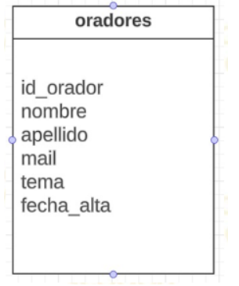
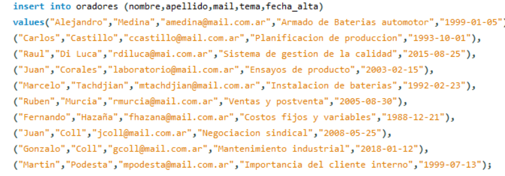
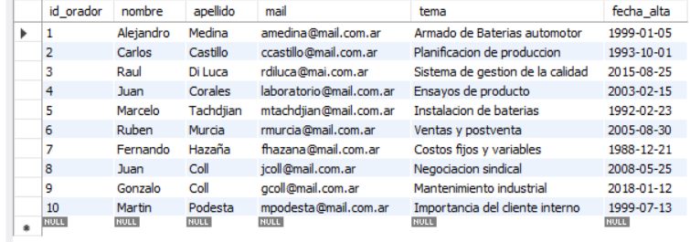

# TP integrador BD

## Trabajo Práctico Integrador Base de Datos

 Se deberá crear una base de datos llamada “integrador_cac” y crear la siguiente tabla llamada “oradores”:

  

- Definir los tipos de datos correspondientes
- Definir la clave primaria correspondiente
- Definir las restricciones correspondientes
- Insertar 10 registros
- Hacer un backup de la base de datos

## Características del proyecto
En este proyecto se realiza practica de la creacion y la insercion de datos con el lenguaje SQL.

La sentencia que se utilizo para crear la tabla es la siguiente:

La version final del proyecto es:

